```mermaid
graph TD
    A[🚀 INNOVATION PIPELINE] --> B[🤖 Large Language Models]
    A --> C[🔄 Advanced MLOps]
    A --> D[☁️ Cloud AI Solutions]
    A --> E[📊 Real-time Analytics]
    A --> F[👁️ Computer Vision]
    
    B --> B1[🎯 LLM Fine-tuning]
    B --> B2[🔍 RAG Applications]
    B --> B3[💬 Conversational AI]
    
    C --> C1[🚀 CI/CD for ML]
    C --> C2[📊 Model Monitoring]
    C --> C3[⚡ Auto-scaling Systems]
    
    D --> D1[🌐 GCP AI Platform]
    D --> D2[☁️ AWS SageMaker]
    D --> D3[🔧 Serverless ML]
    
    E --> E1[⚡ Stream Processing]
    E --> E2[🔮 Predictive Analytics]
    E --> E3[📈 Dashboard Automation]
    
    F --> F1[🎯 Object Detection]
    F --> F2[✂️ Image Segmentation]
    F --> F3[📱 Mobile Vision]
    
    style A fill:#FF6B6B,stroke:#fff,stroke-width:3px,color:#fff
    style B fill:#4ECDC4,stroke:#fff,stroke-width:2px,color:#fff
    style C fill:#45B7D1,stroke:#fff,stroke-width:2px,color:#fff
    style D fill:#96CEB4,stroke:#fff,stroke-width:2px,color:#fff
    style E fill:#FECA57,stroke:#fff,stroke-width:2px,color:#fff
    style F fill:#FF9FF3,stroke:#fff,stroke-width:2px,color:#fff
```

<div align="center">
  


</div>

# <div align="center"> **Hi 👋, I'm Melbin Mathew**</div>

<div align="center">
  
[](https://git.io/typing-svg)

</div>


</div>

```yaml
👨‍💻 Role: AI/ML Engineer 
📊 Specialization: AI/ML Engineering, Data Science, MLOps

🔥 CORE EXPERTISE:
  ├── Artificial Intelligence & Machine Learning
  ├── Computer Vision & Natural Language Processing
  ├── Deep Learning & Neural Networks
  ├── MLOps Pipeline Development
  └── Data Analysis & Visualization

🚀 CURRENTLY MASTERING:
  ├── Large Language Models (LLMs)
  ├── Advanced MLOps Practices
  └── Real-time ML Systems


```

---

<details open>
<summary><strong>🔥 Programming Languages</strong></summary><br>


</details>

<details>
<summary><strong>🤖 AI / Machine Learning Frameworks</strong></summary><br>


</details>

<details>
<summary><strong>📊 Data Science & Visualization</strong></summary><br>


</details>

<details>
<summary><strong>🗄️ Databases</strong></summary><br>


</details>

<details>
<summary><strong>☁️ MLOps & Cloud Platforms</strong></summary><br>


</details>

<details>
<summary><strong>🧰 Development Tools</strong></summary><br>


</details>

<details>
<summary><strong>📊 Business Intelligence Tools</strong></summary><br>


</details>

---

## <div align="center">🎯 **CURRENT FOCUS & INNOVATION** 🎯</div>

<div align="center">



</div>

---

## <div align="center">🌟 **FEATURED PROJECTS & ACHIEVEMENTS** 🌟</div>

<div align="center">

| 🚀 **PROJECT** | 🛠️ **TECH STACK** | ⭐ **STATUS** | 🎯 **IMPACT** |
|----------------|-------------------|---------------|----------------|
| 🤖 **Advanced LLM Fine-tuning Pipeline** | Python, Transformers, MLflow, CUDA | 🔥 **ACTIVE** | Revolutionizing AI Training |
| 📊 **Real-time Analytics Engine** | Streamlit, Plotly, PostgreSQL, Redis | ✅ **DEPLOYED** | 10x Faster Insights |
| 🧠 **Computer Vision Intelligence** | OpenCV, TensorFlow, Flask, Docker | 🚧 **ENHANCING** | Next-Gen Vision AI |
| ☁️ **Enterprise MLOps Platform** | Kubernetes, GCP, Terraform, Airflow | 📋 **ARCHITECTING** | Scalable AI Infrastructure |
| 🔮 **Predictive Analytics Suite** | Scikit-learn, XGBoost, FastAPI | 🎯 **OPTIMIZING** | Smart Business Decisions |

</div>

---

## <div align="center">🌐 **CONNECT & COLLABORATE** 🌐</div>

<div align="center">

### **Let's Build the Future of AI Together!**

[](https://www.linkedin.com/in/melbin-mathew-09385a25a/)
[](https://www.kaggle.com/melbinmathew32)
[](https://huggingface.co/Melbi)
[](https://medium.com/@melbinm32)
[](https://leetcode.com/u/melbinm32/)
[](mailto:melbinm32@gmail.com)

</div>

---
<div align="center">


**⭐ Star repositories that inspire you | 🤝 Collaborate on groundbreaking projects | 🚀 Let's shape the future of AI together!**


</div>
